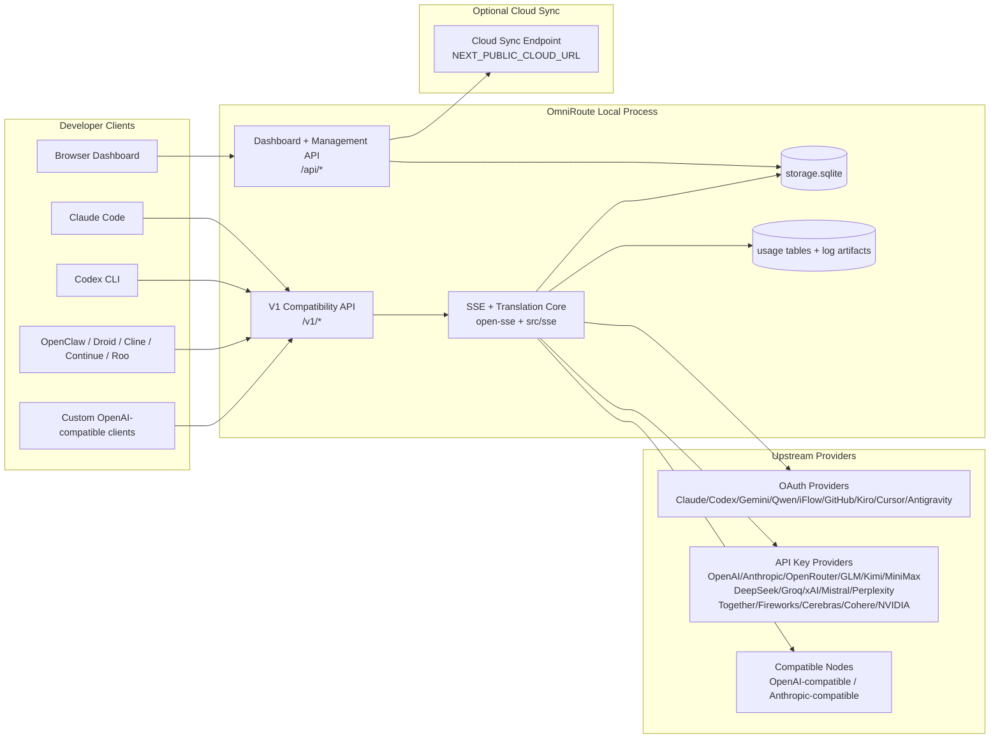
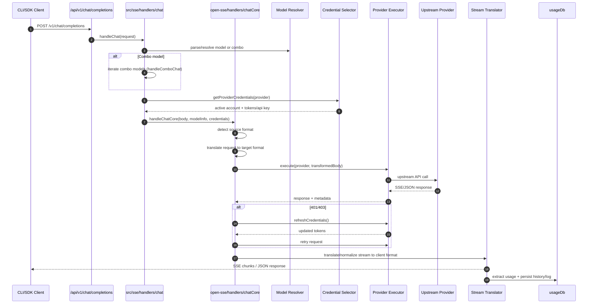
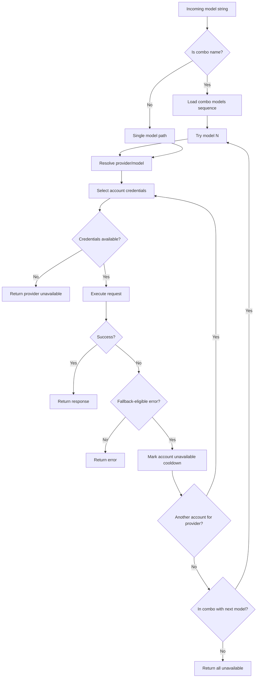
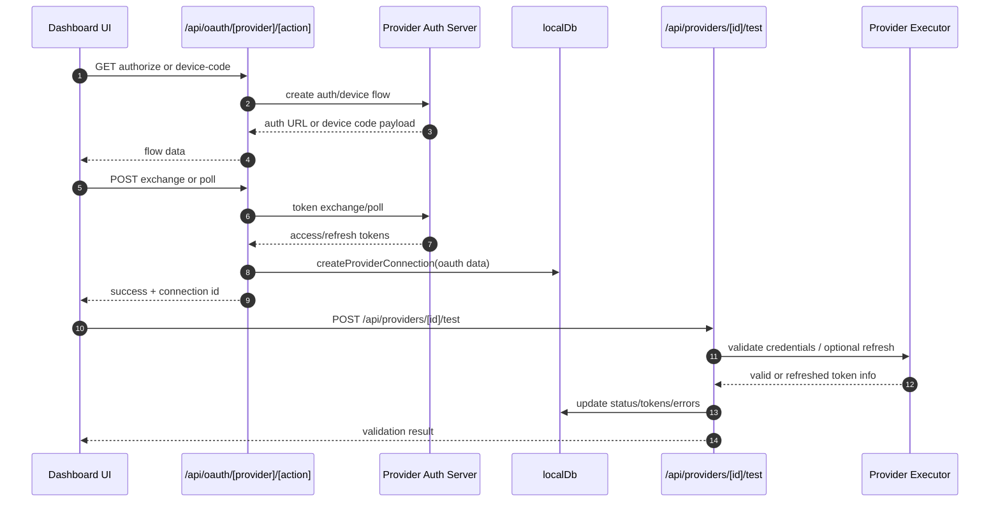
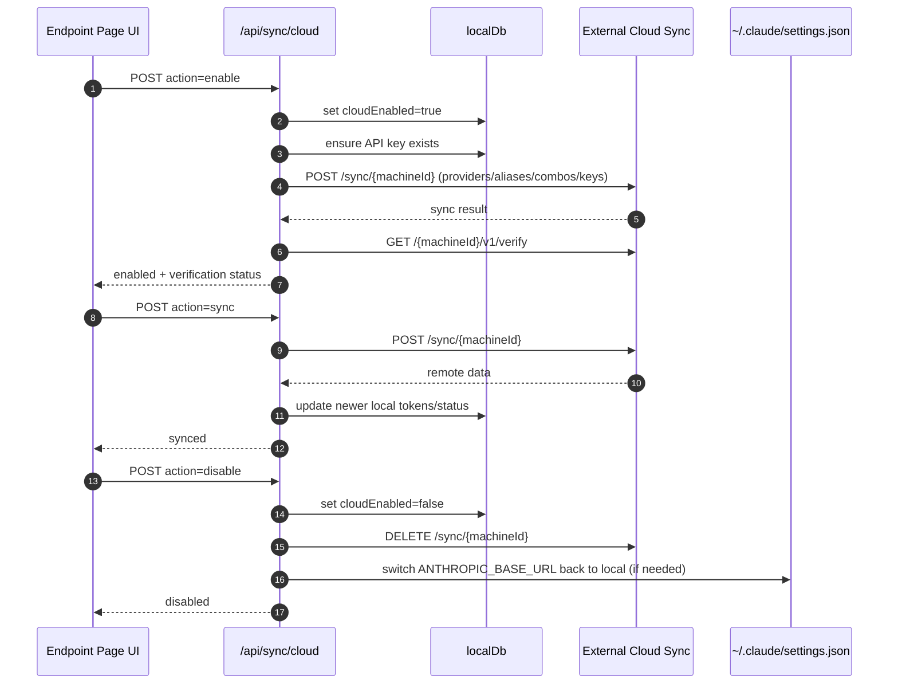
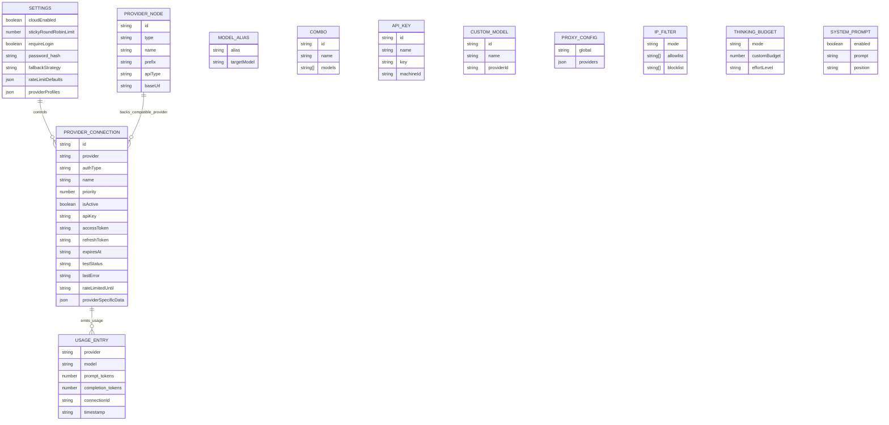
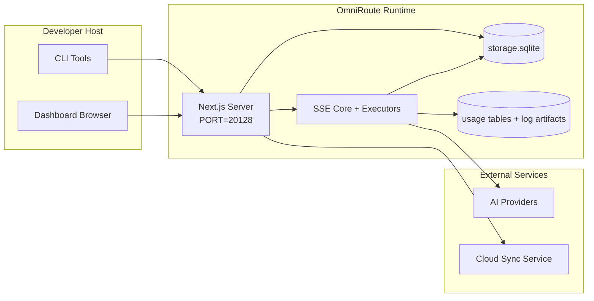

# Architektura OmniRoute

🌐 **Jazyky:** 🇺🇸 [angličtina](ARCHITECTURE.md) | 🇧🇷 [Português (Brazílie)](i18n/pt-BR/ARCHITECTURE.md) | 🇪🇸 [Español](i18n/es/ARCHITECTURE.md) | 🇫🇷 [Français](i18n/fr/ARCHITECTURE.md) | 🇮🇹 [Italiano](i18n/it/ARCHITECTURE.md) | 🇷🇺 [Русский](i18n/ru/ARCHITECTURE.md) | 🇨🇳[中文 (简体)](i18n/zh-CN/ARCHITECTURE.md) | 🇩🇪 [Deutsch](i18n/de/ARCHITECTURE.md) | 🇮🇳 [हिन्दी](i18n/in/ARCHITECTURE.md) | 🇹🇭 [ไทย](i18n/th/ARCHITECTURE.md) | 🇺🇦 [Українська](i18n/uk-UA/ARCHITECTURE.md) | 🇸🇦 [العربية](i18n/ar/ARCHITECTURE.md) | 🇯🇵[日本語](i18n/ja/ARCHITECTURE.md)| 🇻🇳 [Tiếng Việt](i18n/vi/ARCHITECTURE.md) | 🇧🇬 [Български](i18n/bg/ARCHITECTURE.md) | 🇩🇰 [Dánsko](i18n/da/ARCHITECTURE.md) | 🇫🇮 [Suomi](i18n/fi/ARCHITECTURE.md) | 🇮🇱 [עברית](i18n/he/ARCHITECTURE.md) | 🇭🇺 [maďarština](i18n/hu/ARCHITECTURE.md) | 🇮🇩 [Bahasa Indonésie](i18n/id/ARCHITECTURE.md) | 🇰🇷 [한국어](i18n/ko/ARCHITECTURE.md) | 🇲🇾 [Bahasa Melayu](i18n/ms/ARCHITECTURE.md) | 🇳🇱 [Nizozemsko](i18n/nl/ARCHITECTURE.md) | 🇳🇴 [Norsk](i18n/no/ARCHITECTURE.md) | 🇵🇹 [Português (Portugalsko)](i18n/pt/ARCHITECTURE.md) | 🇷🇴 [Română](i18n/ro/ARCHITECTURE.md) | 🇵🇱 [Polski](i18n/pl/ARCHITECTURE.md) | 🇸🇰 [Slovenčina](i18n/sk/ARCHITECTURE.md) | 🇸🇪 [Svenska](i18n/sv/ARCHITECTURE.md) | 🇵🇭 [Filipínec](i18n/phi/ARCHITECTURE.md) | 🇨🇿 [Čeština](i18n/cs/ARCHITECTURE.md)

*Poslední aktualizace: 2026-03-04*

## Shrnutí pro manažery

OmniRoute je lokální směrovací brána a dashboard s umělou inteligencí postavený na Next.js. Poskytuje jeden koncový bod kompatibilní s OpenAI ( `/v1/*` ) a směruje provoz napříč několika upstreamovými poskytovateli s překladem, záložními funkcemi, obnovou tokenů a sledováním využití.

Základní schopnosti:

- API prostředí kompatibilní s OpenAI pro CLI/nástroje (28 poskytovatelů)
- Překlad požadavků/odpovědí napříč formáty poskytovatelů
- Záložní kombinace modelů (sekvence s více modely)
- Záložní řešení na úrovni účtu (více účtů na poskytovatele)
- Správa připojení poskytovatele OAuth + API klíčů
- Generování embeddingů pomocí `/v1/embeddings` (6 poskytovatelů, 9 modelů)
- Generování obrázků pomocí `/v1/images/generations` (4 poskytovatelé, 9 modelů)
- Pro modely uvažování zvažte analýzu tagů ( `<think>...</think>` ).
- Sanitizace odpovědí pro striktní kompatibilitu s OpenAI SDK
- Normalizace rolí (vývojář→systém, systém→uživatel) pro kompatibilitu mezi poskytovateli
- Konverze strukturovaného výstupu (json_schema → Gemini responseSchema)
- Lokální perzistence pro poskytovatele, klíče, aliasy, kombinace, nastavení, ceny
- Sledování využití/nákladů a protokolování požadavků
- Volitelná cloudová synchronizace pro synchronizaci více zařízení/stavů
- Seznam povolených/blokovaných IP adres pro řízení přístupu k API
- Řízení rozpočtu (průchozí/automatické/vlastní/adaptivní)
- Globální systémová výzva k vložení
- Sledování relací a otisky prstů
- Vylepšené omezení sazeb pro jednotlivé účty s profily specifickými pro poskytovatele
- Vzor jističů pro odolnost poskytovatele
- Ochrana stáda proti hromům s uzamčením mutexů
- Mezipaměť pro deduplikaci požadavků založená na podpisech
- Vrstva domény: dostupnost modelu, pravidla nákladů, záložní politika, politika blokování
- Perzistence stavu domény (mezipaměť SQLite pro zápis pro záložní funkce, rozpočty, uzamčení, jističe)
- Modul zásad pro centralizované vyhodnocování požadavků (uzamčení → rozpočet → záložní)
- Vyžádat telemetrii s agregací latence p50/p95/p99
- Korelační ID (X-Request-Id) pro trasování typu end-to-end
- Protokolování auditu shody s předpisy s možností odhlášení pro každý klíč API
- Evaluační rámec pro zajištění kvality LLM
- Řídicí panel uživatelského rozhraní Resilience se stavem jističe v reálném čase
- Modulární poskytovatelé OAuth (12 jednotlivých modulů v adresáři `src/lib/oauth/providers/` )

Primární běhový model:

- Trasy aplikace Next.js v `src/app/api/*` implementují jak API dashboardů, tak i API kompatibility.
- Sdílené jádro SSE/routing v `src/sse/*` + `open-sse/*` zvládá spouštění poskytovatelů, překlad, streamování, záložní operace a využití.

## Rozsah a hranice

### V rozsahu

- Běhové prostředí lokální brány
- Rozhraní API pro správu řídicích panelů
- Ověřování poskytovatele a aktualizace tokenu
- Žádost o překlad a streamování SSE
- Lokální stav + perzistence využití
- Volitelná orchestrace synchronizace s cloudem

### Mimo rozsah

- Implementace cloudové služby za `NEXT_PUBLIC_CLOUD_URL`
- SLA/řídicí rovina poskytovatele mimo lokální proces
- Samotné externí binární soubory CLI (Claude CLI, Codex CLI atd.)

## Kontext systému na vysoké úrovni



## Základní běhové komponenty

## 1) API a směrovací vrstva (trasy aplikací Next.js)

Hlavní adresáře:

- `src/app/api/v1/*` a `src/app/api/v1beta/*` pro rozhraní API pro zajištění kompatibility
- `src/app/api/*` pro API pro správu/konfiguraci
- Další přepisy v `next.config.mjs` mapují `/v1/*` na `/api/v1/*`

Důležité způsoby kompatibility:

- `src/app/api/v1/chat/completions/route.ts`
- `src/app/api/v1/messages/route.ts`
- `src/app/api/v1/responses/route.ts`
- `src/app/api/v1/models/route.ts` — obsahuje vlastní modely s `custom: true`
- `src/app/api/v1/embeddings/route.ts` — generování embeddingů (6 poskytovatelů)
- `src/app/api/v1/images/generations/route.ts` — generování obrázků (4+ poskytovatelů včetně Antigravity/Nebius)
- `src/app/api/v1/messages/count_tokens/route.ts`
- `src/app/api/v1/providers/[provider]/chat/completions/route.ts` — vyhrazený chat pro jednotlivé poskytovatele
- `src/app/api/v1/providers/[provider]/embeddings/route.ts` — vyhrazená vkládání pro jednotlivé poskytovatele
- `src/app/api/v1/providers/[provider]/images/generations/route.ts` — vyhrazené obrazy pro jednotlivé poskytovatele
- `src/app/api/v1beta/models/route.ts`
- `src/app/api/v1beta/models/[...path]/route.ts`

Domény správy:

- Auth/settings: `src/app/api/auth/*` , `src/app/api/settings/*`
- Poskytovatelé/připojení: `src/app/api/providers*`
- Uzly poskytovatele: `src/app/api/provider-nodes*`
- Vlastní modely: `src/app/api/provider-models` (GET/POST/DELETE)
- Katalog modelů: `src/app/api/models/route.ts` (GET)
- Konfigurace proxy: `src/app/api/settings/proxy` (GET/PUT/DELETE) + `src/app/api/settings/proxy/test` (POST)
- OAuth: `src/app/api/oauth/*`
- Klíče/aliasy/kombinace/ceny: `src/app/api/keys*` , `src/app/api/models/alias` , `src/app/api/combos*` , `src/app/api/pricing`
- Použití: `src/app/api/usage/*`
- Synchronizace/cloud: `src/app/api/sync/*` , `src/app/api/cloud/*`
- Pomocné nástroje pro CLI: `src/app/api/cli-tools/*`
- IP filtr: `src/app/api/settings/ip-filter` (GET/PUT)
- Rozpočet pro myšlení: `src/app/api/settings/thinking-budget` (GET/PUT)
- Systémový příkaz: `src/app/api/settings/system-prompt` (GET/PUT)
- Relace: `src/app/api/sessions` (GET)
- Limity rychlosti: `src/app/api/rate-limits` (GET)
- Odolnost: `src/app/api/resilience` (GET/PATCH) — profily poskytovatelů, jistič, stav limitu rychlosti
- Reset odolnosti: `src/app/api/resilience/reset` (POST) — reset jističů + doby zchlazení
- Statistiky mezipaměti: `src/app/api/cache/stats` (GET/DELETE)
- Dostupnost modelu: `src/app/api/models/availability` (GET/POST)
- Telemetrie: `src/app/api/telemetry/summary` (GET)
- Rozpočet: `src/app/api/usage/budget` (GET/POST)
- Záložní řetězce: `src/app/api/fallback/chains` (GET/POST/DELETE)
- Audit shody: `src/app/api/compliance/audit-log` (GET)
- Evals: `src/app/api/evals` (GET/POST), `src/app/api/evals/[suiteId]` (GET)
- Zásady: `src/app/api/policies` (GET/POST)

## 2) SSE + Překladatelské jádro

Hlavní moduly toku:

- Záznam: `src/sse/handlers/chat.ts`
- Orchestrace jádra: `open-sse/handlers/chatCore.ts`
- Adaptéry pro spuštění poskytovatelů: `open-sse/executors/*`
- Detekce formátu/konfigurace poskytovatele: `open-sse/services/provider.ts`
- Analýza/řešení modelu: `src/sse/services/model.ts` , `open-sse/services/model.ts`
- Logika záložního účtu: `open-sse/services/accountFallback.ts`
- Registr překladů: `open-sse/translator/index.ts`
- Transformace streamů: `open-sse/utils/stream.ts` , `open-sse/utils/streamHandler.ts`
- Extrakce/normalizace využití: `open-sse/utils/usageTracking.ts`
- Analyzátor tagů Think: `open-sse/utils/thinkTagParser.ts`
- Obslužná rutina pro vkládání: `open-sse/handlers/embeddings.ts`
- Registr poskytovatelů vkládání: `open-sse/config/embeddingRegistry.ts`
- Obslužná rutina generování obrázků: `open-sse/handlers/imageGeneration.ts`
- Registr poskytovatelů obrázků: `open-sse/config/imageRegistry.ts`
- Sanitizace odpovědí: `open-sse/handlers/responseSanitizer.ts`
- Normalizace rolí: `open-sse/services/roleNormalizer.ts`

Služby (obchodní logika):

- Výběr/skórování účtu: `open-sse/services/accountSelector.ts`
- Správa životního cyklu kontextu: `open-sse/services/contextManager.ts`
- Vynucení filtrování IP adres: `open-sse/services/ipFilter.ts`
- Sledování relací: `open-sse/services/sessionManager.ts`
- Požadavek na deduplikaci: `open-sse/services/signatureCache.ts`
- Vložení systémového promptu: `open-sse/services/systemPrompt.ts`
- Řízení rozpočtu v duchu myšlenek: `open-sse/services/thinkingBudget.ts`
- Směrování pomocí modelu zástupných znaků: `open-sse/services/wildcardRouter.ts`
- Správa limitů rychlosti: `open-sse/services/rateLimitManager.ts`
- Jistič: `open-sse/services/circuitBreaker.ts`

Moduly doménové vrstvy:

- Dostupnost modelu: `src/lib/domain/modelAvailability.ts`
- Pravidla/rozpočty nákladů: `src/lib/domain/costRules.ts`
- Záložní zásady: `src/lib/domain/fallbackPolicy.ts`
- Kombinovaný resolver: `src/lib/domain/comboResolver.ts`
- Zásady uzamčení: `src/lib/domain/lockoutPolicy.ts`
- Modul zásad: `src/domain/policyEngine.ts` — centralizované uzamčení → rozpočet → vyhodnocení záložního režimu
- Katalog chybových kódů: `src/lib/domain/errorCodes.ts`
- ID požadavku: `src/lib/domain/requestId.ts`
- Časový limit načtení: `src/lib/domain/fetchTimeout.ts`
- Požadovat telemetrii: `src/lib/domain/requestTelemetry.ts`
- Shoda/audit: `src/lib/domain/compliance/index.ts`
- Zkušební běžec: `src/lib/domain/evalRunner.ts`
- Perzistence stavu domény: `src/lib/db/domainState.ts` — SQLite CRUD pro záložní řetězce, rozpočty, historii nákladů, stav uzamčení, jističe

Moduly poskytovatelů OAuth (12 jednotlivých souborů v adresáři `src/lib/oauth/providers/` ):

- Index registru: `src/lib/oauth/providers/index.ts`
- Jednotliví poskytovatelé: `claude.ts` , `codex.ts` , `gemini.ts` , `antigravity.ts` , `iflow.ts` , `qwen.ts` , `kimi-coding.ts` , `github.ts` , `kiro.ts` , `cursor.ts` , `kilocode.ts` , `cline.ts`
- Thin wrapper: `src/lib/oauth/providers.ts` — reexporty z jednotlivých modulů

## 3) Vrstva perzistence

Primární stavová databáze (SQLite):

- Základní infrastruktura: `src/lib/db/core.ts` (better-sqlite3, migrace, WAL)
- Reexportní fasáda: `src/lib/localDb.ts` (tenká vrstva kompatibility pro volající)
- soubor: `${DATA_DIR}/storage.sqlite` (nebo `$XDG_CONFIG_HOME/omniroute/storage.sqlite` pokud je nastaveno, jinak `~/.omniroute/storage.sqlite` )
- entity (tabulky + jmenné prostory KV): providerConnections, providerNodes, modelAliases, combos, apiKeys, settings, pricing, **customModels** , **proxyConfig** , **ipFilter** , **thinkingBudget** , **systemPrompt**

Trvalost používání:

- fasáda: `src/lib/usageDb.ts` (dekomponované moduly v `src/lib/usage/*` )
- SQLite tabulky v `storage.sqlite` : `usage_history` , `call_logs` , `proxy_logs`
- Volitelné artefakty souborů zůstávají pro účely kompatibility/ladění ( `${DATA_DIR}/log.txt` , `${DATA_DIR}/call_logs/` , `<repo>/logs/...` )
- Starší soubory JSON jsou migrovány do SQLite při migracích při spuštění, pokud jsou k dispozici.

Databáze stavu domény (SQLite):

- `src/lib/db/domainState.ts` — CRUD operace pro stav domény
- Tabulky (vytvořené v `src/lib/db/core.ts` ): `domain_fallback_chains` , `domain_budgets` , `domain_cost_history` , `domain_lockout_state` , `domain_circuit_breakers`
- Vzor mezipaměti pro zápis: mapy v paměti jsou autoritativní za běhu; mutace se zapisují synchronně do SQLite; stav se obnovuje z databáze při studeném startu.

## 4) Ověřovací a bezpečnostní povrchy

- Autorizace souborů cookie v dashboardu: `src/proxy.ts` , `src/app/api/auth/login/route.ts`
- Generování/ověření klíče API: `src/shared/utils/apiKey.ts`
- Tajné kódy poskytovatele přetrvávaly v položkách `providerConnections`
- Podpora odchozí proxy přes `open-sse/utils/proxyFetch.ts` (proměnné prostředí) a `open-sse/utils/networkProxy.ts` (konfigurovatelné pro jednotlivé poskytovatele nebo globálně)

## 5) Synchronizace s cloudem

- Inicializace plánovače: `src/lib/initCloudSync.ts` , `src/shared/services/initializeCloudSync.ts`
- Periodická úloha: `src/shared/services/cloudSyncScheduler.ts`
- Řídicí trasa: `src/app/api/sync/cloud/route.ts`

## Životní cyklus požadavku ( `/v1/chat/completions` )



## Kombinovaný + záložní proces pro účet



Rozhodnutí o záložních metodách jsou řízena souborem `open-sse/services/accountFallback.ts` s využitím stavových kódů a heuristik chybových zpráv.

## Životní cyklus aktualizace OAuth a onboardingu tokenu



Obnovení během živého provozu se provádí uvnitř `open-sse/handlers/chatCore.ts` pomocí exekutoru `refreshCredentials()` .

## Životní cyklus synchronizace s cloudem (Povolit / Synchronizovat / Zakázat)



Pravidelnou synchronizaci spouští `CloudSyncScheduler` , když je povolen cloud.

## Datový model a mapa úložiště



Soubory fyzického úložiště:

- primární běhová databáze: `${DATA_DIR}/storage.sqlite`
- řádky protokolu požadavku: `${DATA_DIR}/log.txt` (artefakt kompatibility/ladění)
- Archivy strukturovaných dat volání: `${DATA_DIR}/call_logs/`
- volitelné relace překladače/vyžádání ladění: `<repo>/logs/...`

## Topologie nasazení



## Mapování modulů (kritické pro rozhodnutí)

### Moduly tras a API

- `src/app/api/v1/*` , `src/app/api/v1beta/*` : API pro zajištění kompatibility
- `src/app/api/v1/providers/[provider]/*` : vyhrazené trasy pro jednotlivé poskytovatele (chat, vkládání, obrázky)
- `src/app/api/providers*` : CRUD poskytovatele, validace, testování
- `src/app/api/provider-nodes*` : správa uzlů kompatibilních s vlastními nástroji
- `src/app/api/provider-models` : správa vlastních modelů (CRUD)
- `src/app/api/models/route.ts` : API katalogu modelů (aliasy + vlastní modely)
- `src/app/api/oauth/*` : Toky OAuth/kódu zařízení
- `src/app/api/keys*` : životní cyklus lokálního klíče API
- `src/app/api/models/alias` : správa aliasů
- `src/app/api/combos*` : správa záložních kombinací
- `src/app/api/pricing` : přepsání cen pro výpočet nákladů
- `src/app/api/settings/proxy` : konfigurace proxy (GET/PUT/DELETE)
- `src/app/api/settings/proxy/test` : test připojení odchozí proxy (POST)
- `src/app/api/usage/*` : API pro použití a protokoly
- `src/app/api/sync/*` + `src/app/api/cloud/*` : synchronizace s cloudem a pomocníci pro práci s cloudem
- `src/app/api/cli-tools/*` : lokální programy pro zápis/kontrolu konfigurace CLI
- `src/app/api/settings/ip-filter` : Seznam povolených/blokovaných IP adres (GET/PUT)
- `src/app/api/settings/thinking-budget` : konfigurace rozpočtu tokenu thinking (GET/PUT)
- `src/app/api/settings/system-prompt` : globální systémový příkaz (GET/PUT)
- `src/app/api/sessions` : výpis aktivních relací (GET)
- `src/app/api/rate-limits` : stav limitu rychlosti pro účet (GET)

### Směrovací a spouštěcí jádro

- `src/sse/handlers/chat.ts` : parsování požadavků, zpracování kombinací, smyčka výběru účtu
- `open-sse/handlers/chatCore.ts` : překlad, odeslání exekutoru, zpracování opakování/obnovení, nastavení streamu
- `open-sse/executors/*` : chování sítě a formátu specifické pro poskytovatele

### Registr překladů a převodníky formátů

- `open-sse/translator/index.ts` : registr a orchestrace překladačů
- Žádost o překladatele: `open-sse/translator/request/*`
- Překladače odpovědí: `open-sse/translator/response/*`
- Formátovací konstanty: `open-sse/translator/formats.ts`

### Perzistence

- `src/lib/db/*` : perzistentní ukládání konfigurace/stavu a domény v SQLite
- `src/lib/localDb.ts` : reexport kompatibility pro databázové moduly
- `src/lib/usageDb.ts` : fasáda historie použití/záznamů volání nad tabulkami SQLite

## Pokrytí poskytovatele a vykonavatele (strategický vzorec)

Každý poskytovatel má specializovaný exekutor rozšiřující `BaseExecutor` (v `open-sse/executors/base.ts` ), který zajišťuje vytváření URL adres, konstrukci hlaviček, opakování s exponenciálním odkladem, hooky pro obnovení pověření a orchestrační metodu `execute()` .

Vykonavatel | Poskytovatel(é) | Speciální manipulace
--- | --- | ---
`DefaultExecutor` | OpenAI, Claude, Gemini, Qwen, iFlow, OpenRouter, GLM, Kimi, MiniMax, DeepSeek, Groq, xAI, Mistral, Perplexity, Together, Fireworks, Cerebras, Cohere, NVIDIA | Konfigurace dynamické adresy URL/záhlaví pro každého poskytovatele
`AntigravityExecutor` | Google Antigravity | Vlastní ID projektů/relací, analýza Opakování po
`CodexExecutor` | OpenAI Codex | Vkládá systémové instrukce, vynucuje úsilí k uvažování
`CursorExecutor` | IDE kurzoru | Protokol ConnectRPC, kódování Protobuf, podepisování požadavků pomocí kontrolního součtu
`GithubExecutor` | GitHub Copilot | Aktualizace tokenu Copilot, hlavičky napodobující VSCode
`KiroExecutor` | AWS CodeWhisperer/Kiro | Binární formát AWS EventStream → konverze SSE
`GeminiCLIExecutor` | Gemini CLI | Cyklus obnovy tokenu Google OAuth

Všichni ostatní poskytovatelé (včetně uzlů kompatibilních s vlastními funkcemi) používají `DefaultExecutor` .

## Matice kompatibility poskytovatelů

Poskytovatel | Formát | Autorizace | Proud | Nestreamované | Obnovení tokenu | API pro použití
--- | --- | --- | --- | --- | --- | ---
Claude | Claude | Klíč API / OAuth | ✅ | ✅ | ✅ | ⚠️ Pouze pro administrátory
Blíženci | Blíženci | Klíč API / OAuth | ✅ | ✅ | ✅ | ⚠️ Cloudová konzole
Gemini CLI | gemini-cli | OAuth | ✅ | ✅ | ✅ | ⚠️ Cloudová konzole
Antigravity | antigravitace | OAuth | ✅ | ✅ | ✅ | ✅ Plná kvóta API
OpenAI | otevřeno | Klíč API | ✅ | ✅ | ❌ | ❌
Kodex | openai-odpovědi | OAuth | ✅ vynucený | ❌ | ✅ | ✅ Limity sazeb
GitHub Copilot | otevřeno | OAuth + token Copilota | ✅ | ✅ | ✅ | ✅ Snímky kvót
Kurzor | kurzor | Vlastní kontrolní součet | ✅ | ✅ | ❌ | ❌
Kiro | Kiro | OIDC pro jednotné přihlašování AWS | ✅ (Stream událostí) | ❌ | ✅ | ✅ Limity použití
Qwen | otevřeno | OAuth | ✅ | ✅ | ✅ | ⚠️ Na vyžádání
iFlow | otevřeno | OAuth (základní) | ✅ | ✅ | ✅ | ⚠️ Na vyžádání
OpenRouter | otevřeno | Klíč API | ✅ | ✅ | ❌ | ❌
GLM/Kimi/MiniMax | Claude | Klíč API | ✅ | ✅ | ❌ | ❌
Hluboké vyhledávání | otevřeno | Klíč API | ✅ | ✅ | ❌ | ❌
Groq | otevřeno | Klíč API | ✅ | ✅ | ❌ | ❌
xAI (Grok) | otevřeno | Klíč API | ✅ | ✅ | ❌ | ❌
Mistral | otevřeno | Klíč API | ✅ | ✅ | ❌ | ❌
Zmatek | otevřeno | Klíč API | ✅ | ✅ | ❌ | ❌
Společně s umělou inteligencí | otevřeno | Klíč API | ✅ | ✅ | ❌ | ❌
Ohňostroj s umělou inteligencí | otevřeno | Klíč API | ✅ | ✅ | ❌ | ❌
Mozky | otevřeno | Klíč API | ✅ | ✅ | ❌ | ❌
Soudržný | otevřeno | Klíč API | ✅ | ✅ | ❌ | ❌
NVIDIA NIM | otevřeno | Klíč API | ✅ | ✅ | ❌ | ❌

## Pokrytí překladů formátů

Mezi detekované zdrojové formáty patří:

- `openai`
- `openai-responses`
- `claude`
- `gemini`

Cílové formáty zahrnují:

- Chat/Odpovědi v OpenAI
- Claude
- Obálka Gemini/Gemini-CLI/Antigravity
- Kiro
- Kurzor

Překlady používají **jako ústřední formát OpenAI** – všechny konverze procházejí OpenAI jako zprostředkovatel:

```
Source Format → OpenAI (hub) → Target Format
```

Překlady jsou vybírány dynamicky na základě tvaru zdrojového datového obsahu a formátu cílového poskytovatele.

Další vrstvy zpracování v překladovém kanálu:

- **Sanitizace odpovědí** – Odstraňuje nestandardní pole z odpovědí ve formátu OpenAI (streamovaných i nestreamovaných), aby byla zajištěna přísná shoda se SDK.
- **Normalizace rolí** — Převádí `developer` → `system` pro cíle mimo OpenAI; slučuje `system` → `user` pro modely, které odmítají systémovou roli (GLM, ERNIE)
- **Extrakce tagu Think** — Analyzuje bloky `<think>...</think>` z obsahu do pole `reasoning_content`
- **Strukturovaný výstup** — Převede OpenAI `response_format.json_schema` na `responseMimeType` + `responseSchema` z Gemini.

## Podporované koncové body API

Koncový bod | Formát | Psovod
--- | --- | ---
`POST /v1/chat/completions` | Chat s OpenAI | `src/sse/handlers/chat.ts`
`POST /v1/messages` | Claude Messages | Stejný obslužný program (automaticky detekováno)
`POST /v1/responses` | Reakce OpenAI | `open-sse/handlers/responsesHandler.ts`
`POST /v1/embeddings` | Vkládání OpenAI | `open-sse/handlers/embeddings.ts`
`GET /v1/embeddings` | Seznam modelů | Trasa API
`POST /v1/images/generations` | Obrázky OpenAI | `open-sse/handlers/imageGeneration.ts`
`GET /v1/images/generations` | Seznam modelů | Trasa API
`POST /v1/providers/{provider}/chat/completions` | Chat s OpenAI | Vyhrazené pro každého poskytovatele s ověřováním modelu
`POST /v1/providers/{provider}/embeddings` | Vkládání OpenAI | Vyhrazené pro každého poskytovatele s ověřováním modelu
`POST /v1/providers/{provider}/images/generations` | Obrázky OpenAI | Vyhrazené pro každého poskytovatele s ověřováním modelu
`POST /v1/messages/count_tokens` | Počet žetonů Claude | Trasa API
`GET /v1/models` | Seznam modelů OpenAI | Trasa API (chat + vkládání + obrázek + vlastní modely)
`GET /api/models/catalog` | Katalog | Všechny modely seskupené podle poskytovatele + typu
`POST /v1beta/models/*:streamGenerateContent` | Rodák z Blíženců | Trasa API
`GET/PUT/DELETE /api/settings/proxy` | Konfigurace proxy serveru | Konfigurace síťového proxy serveru
`POST /api/settings/proxy/test` | Připojení proxy serveru | Koncový bod testu stavu/připojení proxy serveru
`GET/POST/DELETE /api/provider-models` | Vlastní modely | Správa vlastních modelů pro každého poskytovatele

## Obejít obslužnou rutinu

Obslužná rutina bypassu ( `open-sse/utils/bypassHandler.ts` ) zachycuje známé „throwaway“ požadavky z Claude CLI – warmup pingy, extrakce titulků a počty tokenů – a vrací **falešnou odpověď** bez spotřebování tokenů upstreamového poskytovatele. Toto se spustí pouze tehdy, když `User-Agent` obsahuje `claude-cli` .

## Kanál protokolování požadavků

Záznamník požadavků ( `open-sse/utils/requestLogger.ts` ) poskytuje 7stupňový kanál protokolování ladění, ve výchozím nastavení zakázaný a povolený pomocí `ENABLE_REQUEST_LOGS=true` :

```
1_req_client.json → 2_req_source.json → 3_req_openai.json → 4_req_target.json
→ 5_res_provider.txt → 6_res_openai.txt → 7_res_client.txt
```

Soubory se zapisují do `<repo>/logs/<session>/` pro každou relaci požadavku.

## Způsoby selhání a odolnost

## 1) Dostupnost účtu/poskytovatele

- Doba ochlazování účtu poskytovatele při přechodných chybách/chybách rychlosti/autentizace
- záložní účet před selháním požadavku
- záložní kombinovaný model, když je aktuální cesta modelu/poskytovatele vyčerpána

## 2) Platnost tokenu

- předběžná kontrola a obnovení s opakovaným pokusem o obnovení poskytovatelů
- Opakování 401/403 po pokusu o obnovení v hlavní cestě

## 3) Bezpečnost streamu

- streamovací řadič s vědomím odpojení
- překladový proud s vyprázdněním konce proudu a zpracováním `[DONE]`
- Záložní odhad využití, když chybí metadata využití poskytovatele

## 4) Zhoršení cloudové synchronizace

- Zobrazují se chyby synchronizace, ale lokální běhové prostředí pokračuje.
- Plánovač má logiku umožňující opakování, ale periodické provádění v současné době ve výchozím nastavení volá synchronizaci s jedním pokusem.

## 5) Integrita dat

- Migrace schématu SQLite a automatické aktualizace hooků při spuštění
- Cesta kompatibility migrace starší verze JSON → SQLite

## Pozorovatelnost a provozní signály

Zdroje viditelnosti za běhu:

- protokoly konzole ze `src/sse/utils/logger.ts`
- Agregace využití na požadavek v SQLite ( `usage_history` , `call_logs` , `proxy_logs` )
- textový stav požadavku přihlášení `log.txt` (volitelné/kompatibilní)
- volitelné hluboké protokoly požadavků/překladů v `logs/` pokud `ENABLE_REQUEST_LOGS=true`
- Koncové body použití dashboardu ( `/api/usage/*` ) pro spotřebu v uživatelském rozhraní

## Hranice citlivé z hlediska zabezpečení

- Tajný kód JWT ( `JWT_SECRET` ) zajišťuje ověřování/podepisování souborů cookie relace dashboardu.
- Počáteční bootstrap hesla ( `INITIAL_PASSWORD` ) by měl být explicitně nakonfigurován pro zřizování při prvním spuštění.
- Tajný klíč API HMAC ( `API_KEY_SECRET` ) zabezpečuje formát vygenerovaného lokálního klíče API.
- Tajné klíče/tokeny poskytovatele (klíče/tokeny API) jsou uloženy v lokální databázi a měly by být chráněny na úrovni souborového systému.
- Koncové body synchronizace cloudu se spoléhají na sémantiku ověřování klíče API + ID počítače.

## Matice prostředí a běhového prostředí

Proměnné prostředí aktivně používané kódem:

- Aplikace/autentizace: `JWT_SECRET` , `INITIAL_PASSWORD`
- Úložiště: `DATA_DIR`
- Chování kompatibilního uzlu: `ALLOW_MULTI_CONNECTIONS_PER_COMPAT_NODE`
- Volitelné přepsání úložné základny (Linux/macOS, když `DATA_DIR` není nastaveno): `XDG_CONFIG_HOME`
- Bezpečnostní hashování: `API_KEY_SECRET` , `MACHINE_ID_SALT`
- Protokolování: `ENABLE_REQUEST_LOGS`
- Synchronizace/cloudové URL: `NEXT_PUBLIC_BASE_URL` , `NEXT_PUBLIC_CLOUD_URL`
- Odchozí proxy: `HTTP_PROXY` , `HTTPS_PROXY` , `ALL_PROXY` , `NO_PROXY` a varianty s malými písmeny
- Příznaky funkcí SOCKS5: `ENABLE_SOCKS5_PROXY` , `NEXT_PUBLIC_ENABLE_SOCKS5_PROXY`
- Pomocníci pro platformu/běhové prostředí (ne konfigurace specifická pro aplikaci): `APPDATA` , `NODE_ENV` , `PORT` , `HOSTNAME`

## Známé architektonické poznámky

1. `usageDb` a `localDb` sdílejí stejnou základní adresářovou politiku ( `DATA_DIR` -&gt; `XDG_CONFIG_HOME/omniroute` -&gt; `~/.omniroute` ) se starší migrací souborů.
2. `/api/v1/route.ts` deleguje na stejný jednotný nástroj pro tvorbu katalogů, který používá `/api/v1/models` ( `src/app/api/v1/models/catalog.ts` ), aby se zabránilo sémantickému posunu.
3. Pokud je povoleno, zaznamenávač požadavků zapisuje celé záhlaví/tělo; adresář protokolu je považován za citlivý.
4. Chování cloudu závisí na správné adrese `NEXT_PUBLIC_BASE_URL` a dosažitelnosti cloudového koncového bodu.
5. Adresář `open-sse/` je publikován jako **balíček npm workspace** `@omniroute/open-sse` . Zdrojový kód jej importuje přes `@omniroute/open-sse/...` (vyřešeno pomocí `transpilePackages` v Next.js). Cesty k souborům v tomto dokumentu stále používají název adresáře `open-sse/` pro účely konzistence.
6. Grafy v dashboardu používají **Recharts** (založené na SVG) pro přístupné a interaktivní vizualizace analytiky (sloupcové grafy využití modelu, tabulky s rozpisem poskytovatelů s mírou úspěšnosti).
7. E2E testy používají **Playwright** ( `tests/e2e/` ), spouštěné pomocí `npm run test:e2e` . Unit testy používají **Node.js test runner** ( `tests/unit/` ), spouštěné pomocí `npm run test:unit` . Zdrojový kód pod `src/` je **TypeScript** ( `.ts` / `.tsx` ); pracovní prostor `open-sse/` zůstává JavaScript ( `.js` ).
8. Stránka nastavení je uspořádána do 5 záložek: Zabezpečení, Směrování (6 globálních strategií: fill-first, round robin, p2c, náhodné, nejméně používané, nákladově optimalizované), Odolnost (upravitelné limity rychlosti, jistič, zásady), AI (rozpočet promyšlený, systémový výzva, mezipaměť výzev), Pokročilé (proxy).

## Kontrolní seznam provozního ověření

- Sestavení ze zdroje: `npm run build`
- Sestavení obrazu Dockeru: `docker build -t omniroute .`
- Spusťte službu a ověřte:
- `GET /api/settings`
- `GET /api/v1/models`
- Základní URL cíle CLI by měla být `http://<host>:20128/v1` , pokud `PORT=20128`
